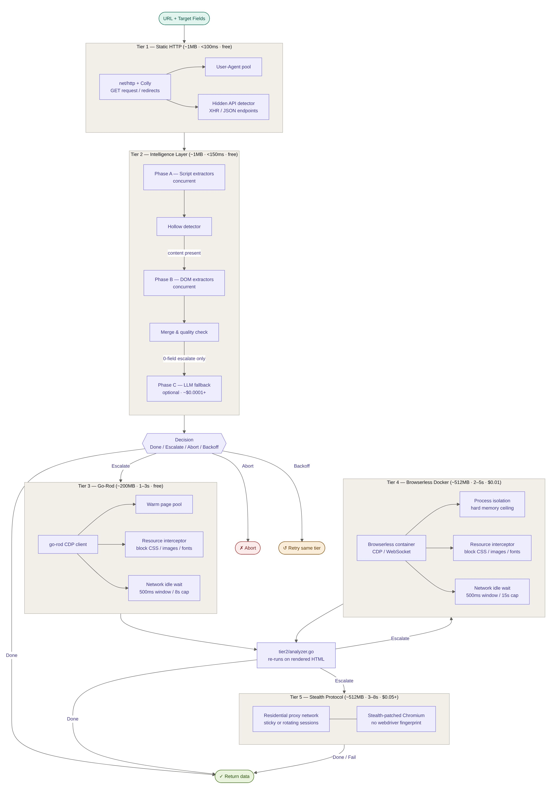

# Data Extraction Pipeline — Documentation Index

**Version:** 1.0  
**Target Throughput:** 10–30 RPS  
**Runtime:** Go  
**Last Updated:** March 2026

---

## Overview

This pipeline extracts structured data from web pages at 10–30 requests per second. It operates as a **cost-escalation ladder**: each tier is more capable but also more expensive in RAM, latency, and money. A request only advances to the next tier when the current one definitively cannot fulfill it.

---

## Architecture
 


---

## Tier Documents

| File | Tier | Status | Summary |
|---|---|---|---|
| [tier1.md](./tier1.md) | Tier 1 | Implemented | Raw HTTP fetch, hidden API detection |
| [tier2.md](./tier2.md) | Tier 2 | Implemented | Intelligence layer — all extractors, merge logic, hollow detection, LLM fallback |
| [tier3.md](./tier3.md) | Tier 3 | Implemented | Lightweight headless Chrome via Go-Rod |
| [tier4.md](./tier4.md) | Tier 4 | Implemented | Dockerized Browserless for complex session flows |
| [tier5.md](./tier5.md) | Tier 5 | Documented | Residential proxies + stealth Chromium for bot-protected sites |
| [adr.md](./adr.md) | All tiers | — | Architecture decision records and trade-off analysis |

---

## Pipeline Philosophy

### Escalate by evidence, not by assumption

A tier advances a request only when it has confirmed evidence that the current tier cannot fulfill the extraction. Guessing or defaulting to a heavier tier is explicitly disallowed.

### Four possible outcomes at every tier

| Decision | Meaning | Next Step |
|---|---|---|
| **Done** | Data found, quality sufficient | Return to caller |
| **Escalate** | This tier cannot get the data | Move to next tier |
| **Abort** | Resource is unavailable (404, 401) | Stop entirely, do not escalate |
| **Backoff** | Rate limited or server error | Retry same tier after delay |

### Cost hierarchy

```
Tier 1   ~1 MB RAM    <100ms    $0.00
Tier 2   ~1 MB RAM    <150ms    $0.00        (runs within Tier 1 response)
Tier 2C  ~1 MB RAM    <15s      ~$0.0001+    (optional LLM fallback, disabled by default)
Tier 3   ~200 MB RAM  1–3s      $0.00        (Go-Rod, local)
Tier 4   ~512 MB RAM  2–5s      $0.01        (Dockerized Browserless)
Tier 5   ~512 MB RAM  3–8s      $0.05+       (Residential proxies)
```

---

## System Architecture

```
┌─────────────────────────────────────────────────────────────────┐
│                        REQUEST ENTRY                            │
│                    URL + Target Fields                          │
└──────────────────────────────┬──────────────────────────────────┘
                               │
                               ▼
┌─────────────────────────────────────────────────────────────────┐
│  TIER 1 — Static HTTP                                           │
│  Go net/http + Colly                                            │
└──────────────────────────────┬──────────────────────────────────┘
                               │
                               ▼
┌─────────────────────────────────────────────────────────────────┐
│  TIER 2 — Content Detection & Multi-Extractor Pipeline          │
│                                                                 │
│  Phase A: Script-tag extractors (concurrent)                    │
│  Phase B: DOM extractors (concurrent, skipped on hollow+hit)    │
│  Phase C: LLM semantic fallback (optional, fires on 0-field     │
│           Escalate only)                                        │
│                                                                 │
│  Done ──────────────────────────────────────────► Return Data   │
│  Abort ─────────────────────────────────────────► Stop          │
│  Backoff ───────────────────────────────────────► Retry Tier 1  │
│  Escalate ──────────────────────────────────────► Tier 3 ▼      │
└──────────────────────────────┬──────────────────────────────────┘
                               │ Escalate
                               ▼
┌─────────────────────────────────────────────────────────────────┐
│  TIER 3 — Lightweight Browser Render            [Implemented]   │
│  Go-Rod (native Go, no Node.js)                                 │
└──────────────────────────────┬──────────────────────────────────┘
                               │ Escalate (session complexity)
                               ▼
┌─────────────────────────────────────────────────────────────────┐
│  TIER 4 — Managed Browser Container             [Implemented]   │
│  Browserless (Docker) via go-rod CDP                            │
└──────────────────────────────┬──────────────────────────────────┘
                               │ Escalate (CAPTCHA / login wall)
                               ▼
┌─────────────────────────────────────────────────────────────────┐
│  TIER 5 — Stealth Protocol                      [Not Yet]       │
│  Residential Proxies + Patched Chromium                         │
└──────────────────────────────┬──────────────────────────────────┘
                               │
                               ▼
                         Return Data / Fail
```